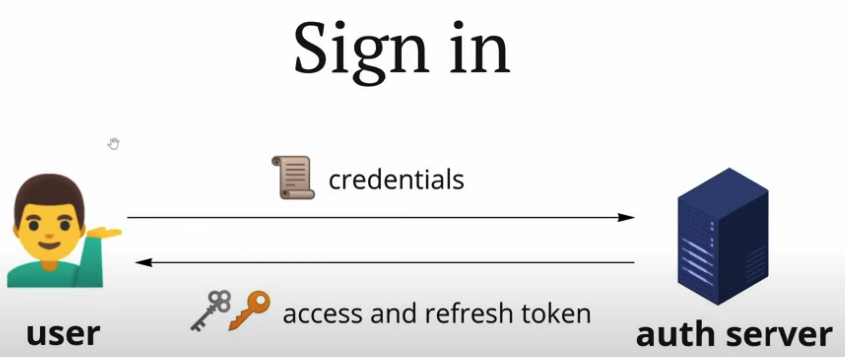
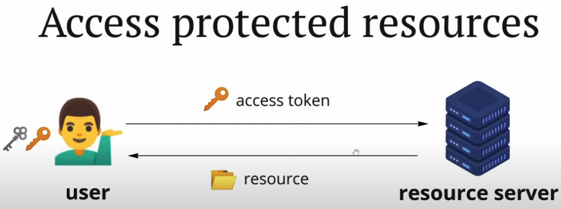
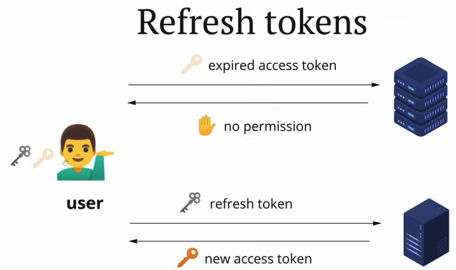
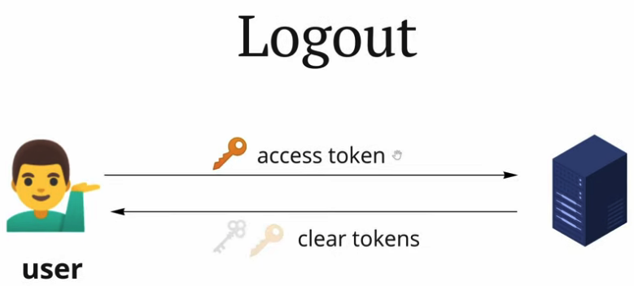
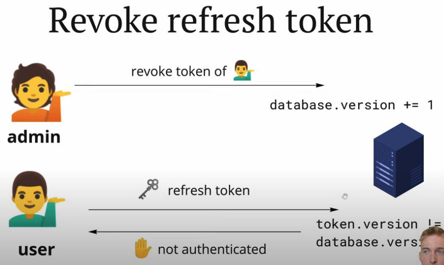

## What is token

## Why
Give user permission without query db everytime

## Why 2 tokens
- refresh token: long lived, keeps user signed in, only purpose is to generate access token
- access token: short live (serval minutes), give user access to resources

## How it works

